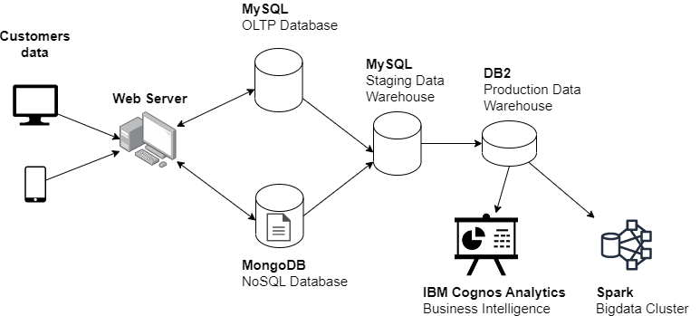

# Overal architecture
Data platform architecture of an ecommerce company named Softee.

**Note:** Although all components in the image are connected to each other, each of them has its own input as csv actually so this project just covers the foundation knowledge of data engineer.

# Tasks detail:
Softee primarily relies on its website for its online presence, accessible by customers through various devices such as laptops, mobiles, and tablets. \\
1 - Transactional data, such as inventory and sales, is kept in a MySQL database server \\
2 - The product catalog data is stored in a MongoDB NoSQL server. \\
3 - The staging data warehouse, which also runs on another MySQL server, receives periodic data extracts from these two databases. \\
4 - Softee's production data warehouse is located on the cloud instance of IBM DB2 server, where BI teams connect to create operational dashboards using IBM Cognos Analytics.\\
5 - For big data analytics, Softee uses a Hadoop cluster to store all the collected data, which is then analyzed using Spark. \\
6 - ETL pipelines running on Apache Airflow are used to transfer data between OLTP, NoSQL, and the data warehouse.\\
